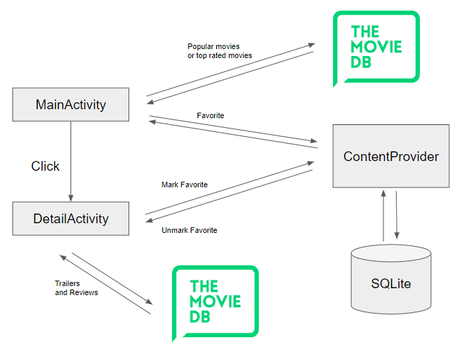

# Popular Movie App

## Demo

## Structure

## Function
- The app retrieves a list of movies from `themoviedb.org` based on the sorting criteria, such as "most popular" and "highest rated".
- The app allows user to see the details of the movie and allows user to mark the movie as favorite.
- Tha app stores the favorite movies in SQLite, using ContentProvider to query, insert, and delete favorite movies.
- The app retrieves a list of trailers and reviews when the user checks the details of the movie.

## API KEY
- Create `Configs.java` in `app/src/main/java/az/android/popularmovie/Configs.java`
- Add `public static final String API_KEY = {USE YOUR OWN API KEY FROM themoviedb.org}`
